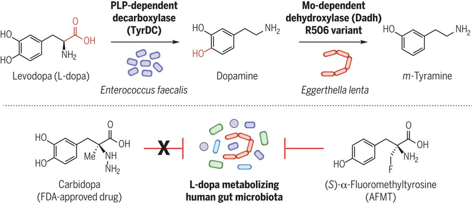

I am a researcher at the University of California, San Francisco studying the gut bacterial metabolism of Parkinson disease drug levodopa with [Peter Turnbaugh](https://turnbaughlab.ucsf.edu/better-living-through-gut-microbes). This research utilizes ex vivo culturing of patient microbiota, NGS, mass spectrometry, and computational biology.

I conducted my undergraduate neuroscience thesis research on visual perception with [Michael Cohen](http://www.michaelacohen.net/research-interests.html). The overarching question for this work: Why do we believe we have a rich perception of the visual world when many peripheral and attentional tasks indicate otherwise? View the [paper](https://direct.mit.edu/jocn/article/36/8/1546/120297/Familiarity-Alters-the-Bandwidth-of-Perceptual).

I first formed an interest in host-microbe interactions while studying the mono-specific mutualism between the Hawaiian bobtail squid and *Vibrio fischeri* in the [McFall-Ngai/Ruby](https://www.glowingsquid.org/index.php) labs. At Amherst, I spent my second and third year working in [Alix Purdy](http://www.apurdylab.org/)'s lab studying colonization-relevant metabolic pathways in *Vibrio fischeri*. 
At the NHGRI, I gained a greater appreciation of the clinical implications of studying fungal residents on and in humans in [Julie Segre](https://www.genome.gov/staff/Julie-Segre-PhD)'s lab. There, I worked with [Diana Proctor](https://dmap02.github.io/personal-website/index.html) to develop computational biology skills and annotate fungal pathogen *Candida auris*'s genome from a hospital outbreak in the US. 

### Interests:
- Microbiology x Neuroscience 
    - How do hosts and microbes communicate with each other? How does that communication differ between mutualistic and parasitic residents? 
    - How can we develop personalized gut microbiota interventions to improve food metabolism and drug efficacy?
    - How are gut microbes modulating "our" brains? How much control do they have over our mood, desires, and actions? If their genetic products play a significant role in our health, are we ready to consider their genomes as part of "us"?
- Perception
    -
- Photography ([site](https://www.skylersung.com))
